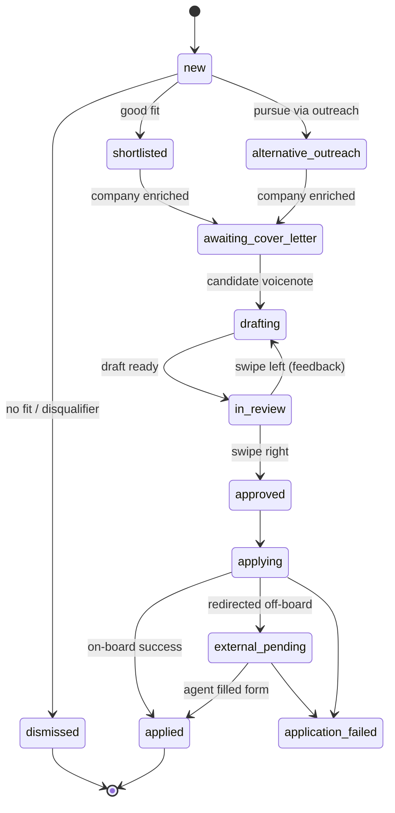
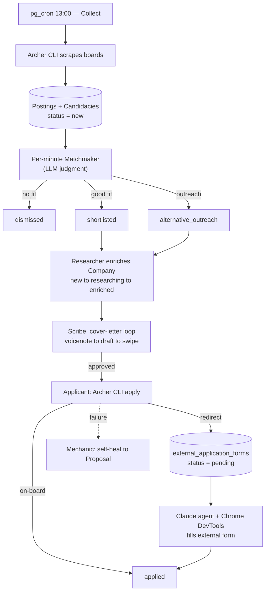

# Archer — Terminology & Architecture (Foundation v0.1)

*Purpose: lock the shared vocabulary and the reference architecture for Archer **before** we map milestones. Everything below is meant to become the exact words we use in tables, statuses, code, and conversation. Where the vision was ambiguous or names collided, I've proposed a resolution and marked it **[decision]**.*

---

## 1. The system in one breath

Archer is a multi-tenant, event-driven platform where **the database is both the source of truth and the orchestrator**. A daily pipeline collects job postings; cheap automations and a matching LLM sort them; and a set of **stateless Claude agents** react to state changes to research companies, draft cover letters, and submit applications. **Humans gate only the decisions that matter** — who gets onto the platform, which cover letter is good enough to send, and which agent proposals to approve. Every unit of work an agent performs is a tracked **Activity** — which is also exactly what the app streams to the user so they can watch Archer work in real time.

The whole thing is a **choreographed state machine**: an insert or status change in Postgres fires a trigger or webhook, that wakes an agent, the agent does work and writes a new state, and the next trigger fires. **Kanban boards are simply human-readable views of these state machines.**

---

## 2. The ubiquitous language

One shared vocabulary, used everywhere. If a word appears here, it should appear in the schema, the code, and our conversations — and nowhere should two words mean the same thing.

### 2.1 Actors & agents

- **Candidate** — an end user. (a.k.a. User / Member.)
- **Owner / Operator** — you. Approves proposals and oversees the system from the admin app.
- **Archer** — the single persona the candidate talks to. Under the hood "Archer" is several **worker roles** sharing one identity and one memory:
  - **Guide** — runs onboarding.
  - **Matchmaker** — the matching engine (note: an LLM *judgment* step, not a tool-using agent).
  - **Researcher** — company enrichment (LinkedIn MCP + Firecrawl).
  - **Scribe** — the cover-letter loop.
  - **Applicant** — submits applications (CLI + external-form filling).
  - **Mechanic** — self-healing of the CLI.

  Naming the roles lets us talk about each pipeline stage precisely even though the candidate only ever sees "Archer."
- **Thomas / Shelby** — sibling agents from the wider vision (orchestrator / content strategist). **Out of scope** for this product; listed only to keep the boundary clear.

### 2.2 Core entities

- **Posting** vs **Candidacy** — **[decision]** Separate the ad on the board from the user's pursuit of it. A **Posting** is one job ad (deduplicated across boards). A **Candidacy** is *a specific candidate pursuing a specific posting*, and it is the record that carries the kanban lifecycle. Why: the same ad shows up on multiple boards and can match multiple candidates, so the objective ad and the per-user state must live in different tables.
- **Company** / **Contact** — an employer and the people on its team (name, email, LinkedIn, notes).
- **Profile** — the maturing picture of the candidate: resume, portfolio, experience, skills, education, salary, notice period — fed and refined by the **Onboarding Transcripts**.
- **Target Titles** — the 1–5 roles a candidate is accepted to apply under; the search keys for collection.
- **Negative Criteria** — explicit disqualifiers (e.g. "no C#"), used by the Matchmaker.
- **Cover Letter** — a per-candidacy draft built from the candidate's voicenote.
- **Application** / **External Application Form** — the on-board application versus the off-board redirect case.
- **Activity (Run)** — **the universal task primitive.** Every unit of daily work — a collect run, an enrichment, a cover-letter generation, an apply attempt, an external-form fill, a proposal execution, a CLI repair — is an Activity with a status (begin → in progress → succeeded/failed) and a log. This is the backbone of *both* execution and the live UI.
- **Proposal** — an agent's request to the Owner to do something privileged (e.g. write a new CLI route, then rebuild and redeploy).
- **Board / Source** + **Adapter** — a job site (PNET, CareerJunction, CareerJet, TotalJobs) and the board-specific code that knows how to collect and apply on it.
- **Account / Membership** — the candidate's platform state, including the go-live gate.

### 2.3 Status vocabulary — the state machines (= kanban columns)

- **Account / go-live:** `onboarding → submitted → under_review → accepted | rejected`
  *(accept requires 1–5 target titles **and** profile completeness)*
- **Candidacy (the jobs kanban):**
  `new → dismissed | shortlisted | alternative_outreach`
  then `→ awaiting_cover_letter → drafting ⇄ in_review → approved → applying → applied | external_pending → applied | application_failed`
- **Company:** `new → researching → enriched | enrichment_failed`
  *(only leaves `new` once a linked candidacy is shortlisted / alternative_outreach)*
- **Cover Letter:** `requested → drafting ⇄ in_review → approved`
- **External Application Form:** `pending → in_progress → completed (applied) | failed`
- **Activity (Run):** `queued → in_progress → succeeded | failed`
- **Proposal:** `submitted → approved | rejected → in_progress → completed | failed`

### 2.4 Concept names

- **The Acceptance Gate** — the OfferZen-style "request to go live": a ≤24h review where prompts judge depth, sincerity, and humanity, and confirm the two hard requirements (titles + profile completeness). Doubles as a cost/abuse filter.
- **The Matching Engine** — the per-minute sort of `new` candidacies into dismiss / shortlist / alternative_outreach.
- **Company Enrichment** — research deliberately gated *behind* shortlisting, to avoid spending tokens on companies the candidate won't apply to.
- **The Cover-Letter Loop** — voicenote → draft → swipe-right (approve) / swipe-left (re-record feedback) → repeat.
- **Apply Adapters** — per-board apply code; brittle by nature, which is why the Mechanic exists.
- **Self-Healing CLI** — a failed Activity triggers an investigation agent → a Proposal → rebuild/redeploy.
- **Proposals & Approvals** — the agent-to-owner control channel.
- **Live Agent View (AG-UI)** — streaming a candidate's *own* Activities to their phone as typed events.

---

## 3. Reference architecture

### 3.1 The four planes

- **Clients** — Mobile app (candidate: onboarding, cover-letter swipe loop, live view, notifications); Admin app (owner: proposal approvals, oversight); optional Web app on the same database.
- **Control plane — Supabase** — Postgres as the source of truth, with **Row-Level Security** for per-candidate isolation; Auth; Storage (resumes/portfolios); **pg_cron** (13:00 collect, per-minute matcher); **Database/Edge Functions + Triggers** (the event engine); the **matching LLM** (via OpenRouter); **Realtime** as a candidate-facing transport for the live view.
- **Execution plane — your server (Hetzner)** — a **Hono API** wrapping `claude -p` / the Claude Agents SDK, authenticated with your **OAuth token** (not the metered API); **Claude Code agent workers** (Researcher, Scribe, Applicant, Mechanic); the **Archer MCP** (a custom, least-privilege tool surface); third-party tools (**LinkedIn MCP**, **Firecrawl**, **Chrome DevTools MCP**); **ElevenLabs** (Speech v3 TTS for Archer's spoken notes, plus STT for the candidate's voicenotes — **[decision]** confirm the STT provider); and the **Archer CLI**.
- **DevOps plane** — a **monorepo**; **GitHub Actions** + **Komodo** for CI/CD and Docker deploys; the self-healing loop closes here.

### 3.2 Agents vs automations vs LLM-judgments

A distinction worth keeping in the vocabulary, because it drives cost and reliability:

- **Automations** — deterministic Postgres functions / triggers / cron. Cheap and reliable. (Moving records, firing webhooks.)
- **LLM-judgments** — single-shot model calls that return a decision. (The Matchmaker.)
- **Agents** — tool-using, multi-step Claude workers. Powerful, costly, and the reason AG-UI exists (to make their work legible). (Researcher, Scribe, Applicant, Mechanic.)

### 3.3 The control spine

The database is the orchestrator, not just storage. State changes — not a central scheduler — drive the system. A row inserted or updated fires a Postgres trigger, which either runs an edge function or POSTs a webhook to the Hono API; the API spawns the right agent Activity; the agent does its work using the Archer MCP and writes the result back as a new state; that write fires the next trigger. Agents stay **stateless** — all durable state lives in Postgres — which is what makes them safe to retry, run in parallel, and stream.

### 3.4 The daily lifecycle (happy path)

1. **13:00, weekdays — Collect.** pg_cron starts a Collect Activity per board. The Hono API runs the Archer CLI, which scrapes that day's postings under each candidate's target titles, deduplicates, and inserts **Postings** + per-candidate **Candidacies** at status `new`.
2. **Every minute — Match.** The matcher cron does nothing unless `new` candidacies exist; otherwise the Matchmaker LLM scores each against the profile + negative criteria and sets `dismissed` (with a logged reason), `shortlisted`, or `alternative_outreach`.
3. **On shortlist / alt — Enrich.** The linked Company leaves `new`; the Researcher (LinkedIn MCP + Firecrawl) advances it `researching → enriched | enrichment_failed`.
4. **On shortlist + enriched — Cover-letter loop.** The Scribe composes a spoken note (ElevenLabs) + push notification; the candidate records a voicenote; the Scribe drafts; the candidate swipes right (approve) or left (re-record). Repeat until `approved`.
5. **On approve — Apply.** An Apply Activity runs the Archer CLI's apply adapter for that board → `applied`, or a redirect.
6. **On redirect — External fill.** A row lands in `external_application_forms` at `pending`; a trigger webhooks the server; a Claude agent opens the URL via Chrome DevTools, reads profile/portfolio/cover letter/enriched company through the Archer MCP, fills the form, and sets `applied | failed`.
7. **Throughout — Live view.** Each Activity streams AG-UI events to the candidate's own live view.
8. **On any failure — Self-heal.** A failed Collect/Apply Activity webhooks the Mechanic, which investigates and may submit a Proposal to repair the CLI; on your approval it rebuilds and redeploys via Komodo.

### 3.5 Where the human stands — three gates

- **Acceptance Gate** — controls *who* gets in (and caps system load).
- **Cover-letter approval** — controls *what gets sent* on the candidate's behalf.
- **Proposal approval** — controls *what the system does to itself* (code changes, redeploys).

---

## 4. Decisions to settle before milestones

1. **Posting vs Candidacy split.** Recommend **yes** — it's the cleanest way to handle dedup + multi-tenancy + a per-user kanban. Everything else assumes it.
2. **Personal-scale vs multi-tenant execution.** The OAuth / `claude -p` model is perfect for an MVP serving *you* (and a tiny accepted cohort), but one person's Claude subscription can't legitimately run thousands of users' agents. Recommend: **build personal-first**; treat true multi-tenant agent execution (a hosted agent runtime, per-org keys) as a later milestone. The Acceptance Gate conveniently caps load until then.
3. **Orchestration mechanism.** Standardize on **Postgres triggers + webhooks + Hono** as the spine. Decide explicitly whether **n8n** stays (handy for schedules/glue) or is retired for this product, so we don't have two overlapping orchestrators.
4. **AG-UI transport.** Supabase Realtime vs a dedicated SSE stream from Hono. Either way, channels must be **per-candidate and RLS-guarded** — you watch *your* Archer, never anyone else's.
5. **Fan-out model.** Confirm the Matchmaker evaluates each new Posting against *every* accepted candidate's titles/criteria (creating Candidacies), versus a single-user MVP that sidesteps fan-out entirely.
6. **Naming.** **[decision, updated 2026-06-19]** The agent and the CLI both fall under **Archer** — the CLI (`@archer/cli`, invoked as `archer`) is Archer's command-line face, not a separate brand. Product/app name still open (**Job Zooka**?).
7. **Voicenote STT.** ElevenLabs covers TTS; choose the speech-to-text path for the candidate's voicenotes (on-device, Whisper, or other).
8. **Secrets & compliance.** Per-candidate board credentials need a real vault/encryption story. Auto-apply + residential proxies (Decodo) + scraping carry ToS/anti-bot risk worth designing around early rather than retrofitting.

---

## 5. What's next

Once you're happy with this language and shape, we map milestones. A sequence I'd suggest, smallest shippable slice first:

- **M0** — single-candidate vertical slice, CareerJunction only: collect → match → manual apply.
- **M1** — the cover-letter loop + live agent view.
- **M2** — company enrichment.
- **M3** — the external-form agent.
- **M4** — self-healing CLI + proposals/approvals.
- **M5** — multi-board (PNET, CareerJet, TotalJobs).
- **M6** — multi-tenant + the Acceptance Gate.

Brick by brick.
