# Archer — CI/CD Pipeline (v0.2, built)

*Successor to `Archer-Monorepo-and-CICD-Plan.md` (v0.1). v0.1 was the plan; this is
what was built, why, and what's left to switch on. Companion to
`Archer-Terminology-and-Architecture.md`.*

---

## 0. The thesis

In a normal project CI/CD is developer plumbing. In Archer it's also an **actuator
the product fires on itself** — the vision has agents "request a revision to the CLI
followed by a rebuild and redeploy through the pipeline." So the design goal isn't
"fast and green," it's:

> **Make the gates trustworthy enough to hand an autonomous agent the keys to prod.**

Every gate does double duty — it protects you from a bad human commit *and* it's the
guardrail that makes an agent-authored change safe to merge and deploy.

## 1. Shape — three loops + a meta-loop

```mermaid
flowchart LR
    subgraph LOCAL["① Inner loop — local (seconds)"]
        H["Husky + lint-staged<br/>Biome · Ruff · commitlint · gitleaks"]
    end
    subgraph CI["② Integration loop — GitHub Actions (minutes)"]
        AFF["affected:<br/>lint · typecheck · test"]
        DRIFT["DB-contract drift gate"]
        SEC["supply chain:<br/>Trivy · gitleaks · CodeQL"]
        IMG["build → GHCR :sha (signed)"]
        AFF --> DRIFT --> SEC --> IMG
    end
    subgraph CD["③ Delivery loop — Komodo GitOps"]
        PROC["procedure: deploy → smoke"]
        ACT["deploy Activity → Supabase"]
        PROC --> ACT
    end
    H -->|push / PR| CI
    IMG -->|release.yml calls Komodo| CD
    ACT -. failure .-> PROP["Proposal (self-heal)"]
    PROP -. approved .-> AGENT["agent opens PR"]
    AGENT --> H
```

The dotted path is the meta-loop: the pipeline feeds its own outcomes back into the
product's Proposal primitive — exactly the self-healing loop the architecture doc
describes, drawn as infrastructure.

## 2. What was built (file map)

| Area | Files |
|---|---|
| **Layout** | hoisted `code/*` → `services/{api,cli}` + `packages/db`; `pnpm-workspace.yaml`, root `package.json` scripts |
| **Inner loop** | `.husky/{pre-commit,commit-msg,pre-push}`, `biome.json`, `ruff.toml`, `commitlint.config.js`, `.lintstagedrc.json`, `.gitleaks.toml`, `.changeset/`, `.editorconfig`, `.nvmrc` |
| **Contract gate** | `packages/db/` (`@archer/db`): generated `src/database.types.ts`, `scripts/gen-types.sh` (+`--check`), `scripts/lint-migrations.sh`, `_bootstrap.sql`, `.squawk.toml` |
| **Containers** | `services/{api,cli}/Dockerfile` (multi-stage `pnpm deploy`), `.dockerignore` |
| **CI** | `.github/workflows/ci.yml` — change-detection-gated node / db / python / docker / security jobs + `ci-ok` aggregator |
| **Release** | `.github/workflows/release.yml` — verify → build+SBOM+provenance+cosign sign → GHCR → gated Komodo deploy → deploy-Activity |
| **Quality/sec** | `codeql.yml`, `dependency-review.yml`, `renovate.json`, `canary.yml` |
| **Runtime (GitOps)** | `infra/komodo/resources.toml`, `compose/archer-api.compose.yaml`, `actions/archer-smoke.ts`, `scripts/{redeploy,record-deploy-activity}.sh` |
| **Observability** | `infra/observability/` — Uptime Kuma + dead-man's-switch |
| **Governance** | `.github/CODEOWNERS`, `pull_request_template.md` |

## 3. The toolchain (and why each earns its place)

- **Biome** (TS) + **Ruff** (Python) — one fast-Rust philosophy across both languages.
- **Husky + lint-staged + commitlint** — cheap deterministic checks; conventional
  commits make *agent* commits machine-parseable for versioning.
- **gitleaks** — this repo holds Supabase keys, a Claude OAuth token, Decodo/board
  creds; a single leak is catastrophic. Hook (best-effort) + CI (hard gate).
- **DB-contract drift gate** ⭐ — `gen-types.sh` applies the migrations to an
  ephemeral Postgres (with a minimal `auth` stub) and regenerates types; CI runs it
  with `--check` and fails on staleness. This enforces "the database is the contract"
  at CI time, hermetically (no DB secret needed). squawk lints unsafe DDL (advisory).
- **Trivy + CodeQL + dependency-review** — vulns, code scanning, supply-chain of deps.
- **SBOM + SLSA provenance + cosign** ⭐ — when an agent can trigger a deploy you must
  guarantee the artifact deployed is the one CI built and a human approved.
- **Renovate** — monorepo-aware updates (pnpm + Dockerfile digest pinning + Actions),
  auto-merging green patches.
- **Changesets** — per-package versions + changelog; the version becomes the image tag.
- **Komodo (GitOps)** — runtime as version-controlled TOML; Actions builds, Komodo deploys.
- **Uptime Kuma** — uptime + a dead-man's-switch on the 13:00 collect (absence = alert).

## 4. Signature decisions

- **Polyglot, contract-first.** TS and (future) Python never share code — they share
  the Postgres schema. The drift gate is the enforcement.
- **Actions builds, Komodo deploys.** Clean split; Komodo has no `[[build]]`.
- **Non-managed Komodo sync.** Never deletes the sibling stacks (`finance`,
  `job-hunter`, `n8n`, `shelby`, `akuna-matata`, hermes `archer`). Review-then-execute.
- **Pinned, signed deploys + rollback.** `ARCHER_API_IMAGE` variable pins a `:sha`;
  rollback = re-pin a prior sha + redeploy. cosign-verify before trust.
- **The three human gates map to GitHub-native controls.** Proposal-approval =
  `production` Environment required reviewers + branch protection requiring `ci-ok`.

## 5. Status — verified vs. dormant

**Verified locally during the build:**
- Restructure: topological build (api → cli), typecheck, typed RPC link intact.
- Inner loop: Biome clean, Vitest green (2 tests), commitlint accept/reject.
- Docker: `archer-api` builds + serves `/health`; `archer-cli` bundles its workspace dep.
- Drift gate: real types generated from migrations; `--check` idempotent.
- Workflows: `actionlint` clean.

**Dormant by design (activate when their inputs exist):**
- Python CI job (gated on `pyproject.toml` — fires when the CLI becomes Python).
- `record-deploy-activity.sh` / canary Proposal (need the `activities`/`proposals`
  tables — milestones M0/M4).
- Board-adapter canary dry-run (needs the CLI + adapters — M0/M5).

## 6. Go-live checklist (the handoff)

These need your credentials/clicks — the artifacts are all built:

1. **GitHub → Settings → Secrets/Variables → Actions**
   - Secrets: `KOMODO_URL`, `KOMODO_API_KEY`, `KOMODO_API_SECRET`, `SUPABASE_URL`, `SUPABASE_SECRET_KEY`
   - Variables: `KOMODO_PROCEDURE=archer-deploy`, `ARCHER_API_HEALTH_URL`
2. **GitHub → Environments → `production`** — add yourself as a required reviewer (the deploy gate).
3. **GitHub → Branch protection on `main`** — require `ci-ok` + 1 review (CODEOWNERS).
4. **Komodo** — create the `archer-gitops` ResourceSync (`infra/komodo`), review diff, execute; set stack env + `ARCHER_ALERT_WEBHOOK`.
5. **Renovate** — install the GitHub App (or self-host) to activate `renovate.json`.
6. **Uptime Kuma** — deploy `infra/observability`, add the `/health` + `daily-collect` Push monitors.
7. **GHCR** — first `release.yml` run publishes `ghcr.io/thomas-adam-leigh/archer-{api,cli}` (make them private if desired).

Brick by brick — but now the bricks land on rails.
