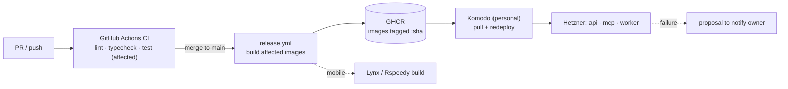

# Archer — Monorepo, CI/CD & Build Orchestration Plan (v0.1)

*Companion to `Archer-Terminology-and-Architecture.md`. This is the "ground-up" plan: how the repo, the pipeline, and the build-time control loop are shaped before we write feature code. Recommendations are marked **[rec]**; open forks are marked **[decision]**.*

---

## 0. Operating model — you are the only user (for now)

You are admin, owner, and operator — a tenant of one. Lean into it: the Acceptance Gate is trivially satisfied, auth is just you, and the **Proposals & Approvals** loop from the architecture doc has exactly one approver. So we build the *owner/operator surfaces first* and let multi-tenant concerns wait (foundation-doc milestone M6).

The counter-intuitive part you flagged is the right instinct: **the scaffolding that lets us build is itself the first slice of the product.** The propose-and-notify loop below is both how we drive the build and a core product primitive.

---

## 1. The "envision-next + reach-out" loop — build it first (it's dual-use)

You asked to empower me (Claude) to think about what's next, write it to the database, and reach out to you. That is *exactly* the product's **Proposal** primitive — so building it now does double duty.

- A tiny MCP — `services/mcp` — exposing a thin surface: `propose(title, rationale, plan)` → inserts a row into `proposals` (status `submitted`); `list_proposals()`; `notify_owner(message, ref)` → inserts into `notifications` and pushes to your phone.
- During the build, I call `propose(...)` with the next brick; you approve/reject from a dead-simple admin screen (or even the raw Supabase table at first). Later, the *exact same tools* are what Archer's Mechanic uses to propose CLI repairs and what the Scribe uses to surface cover letters.
- This turns "use Claude to envision what's next" into a durable, auditable loop instead of ad-hoc chat — every next-step decision is a row with a rationale and a status.

**Why first:** it's the smallest end-to-end vertical that exercises the whole spine (agent → DB write → trigger → notify → human approval → status change), and we reuse it forever.

---

## 2. Monorepo structure **[rec]**

One git repo, **pnpm workspaces only** (Turborepo/Nx deferred until builds are slow enough to justify a task cache). The Python CLI lives in the same repo, managed by **uv** (polyglot). Three top-level groups — and this answers your apps-vs-packages question directly:

- `apps/` = the three **front-ends** you pictured (mobile, web, admin).
- `services/` = independently deployable **backends** (api, cli, mcp, worker). *This is where API and CLI go* — not `packages/`. They're deployable products, not shared libraries.
- `packages/` = **shared libraries** that other workspaces import (types, db client, config, ui).

(If you'd rather use two buckets, API/CLI/MCP are simply "apps" and `packages/` is libs — Turborepo treats them identically. `services/` is just a clearer name for humans, and keeps `apps/` meaning "things with a UI," which matches how you described it.)

```
archer/
├─ apps/
│  ├─ mobile/         # candidate app — Lynx (ReactLynx, TypeScript)
│  ├─ web/            # candidate/marketing web (same DB)
│  └─ admin/          # owner/operator dashboard (approvals, oversight, live view)
├─ services/
│  ├─ api/            # Hono API over `claude -p` / Agents SDK (OAuth token)
│  ├─ cli/            # Scout — Python (Patchwright + Decodo): `collect` + `apply`
│  ├─ mcp/            # Archer MCP: propose, notify_owner, profile/company/status tools
│  └─ worker/         # agent runners (Researcher, Scribe, Applicant) — optional split from api
├─ packages/
│  ├─ core/           # domain types, status enums, state-machine defs (TS source of truth)
│  ├─ db/             # Supabase client + generated TS types
│  ├─ config/         # shared tsconfig, eslint, prettier
│  └─ ui/             # shared components (web + admin)
├─ supabase/
│  ├─ migrations/     # Postgres schema = the cross-language contract (enums, tables, triggers)
│  ├─ functions/      # edge functions
│  └─ seed.sql
├─ infra/komodo/      # compose files + Komodo resource definitions
├─ docs/              # foundation doc + this plan
├─ .github/workflows/ # ci.yml · release.yml · mobile.yml
├─ pnpm-workspace.yaml
└─ package.json       # workspace root scripts (no turbo.json — pnpm-only)
```

### The polyglot wrinkle (TS + Python + maybe Dart)
The Python CLI can't import your TS `packages/core`. So don't try to share code across languages — **share the contract instead**: the Postgres schema in `supabase/migrations` is the single source of truth for status enums and tables. TypeScript generates types from it (`supabase gen types typescript`); Python generates its own models from the same schema. This is the same principle as the architecture doc — *the database is the contract* — applied to the repo.

> Note: with **Lynx (ReactLynx)** the mobile app is TypeScript, so the whole front-end + API + MCP share one JS/TS toolchain and `apps/mobile` is a normal pnpm workspace (built via Lynx's Rspeedy CLI). The only true polyglot piece is `services/cli` (Python) — it sits inside the repo but outside the pnpm workspace and gets its own CI job (uv / ruff / pytest). One caveat worth holding: Lynx is young (open-sourced early 2025), so its library ecosystem and CI recipes are thinner than React Native or Flutter — budget a little extra time for native build wiring and gaps in third-party packages.

---

## 3. CI/CD pipeline — sophisticated, not heavy

Principles: **only build/test/deploy what changed**, one image per service, `main` → prod behind a manual gate (you're the operator), mobile on its own track.

- **Change detection (no Turborepo):** pnpm does this natively — `pnpm --filter "...[origin/main]" build` runs only the workspaces affected since `main` — paired with `dorny/paths-filter` to gate jobs and `actions/cache` on the pnpm store for fast installs. You lose Turborepo's task-output cache; at this scale that's an acceptable trade, and you can drop Turborepo in later without restructuring.
- **`ci.yml` (on PR):** install → lint → typecheck → unit test → build affected. Separate Python job for `services/cli` (ruff + pytest).
- **`release.yml` (on push to `main`):** build affected service images → push to **GHCR** tagged with the commit SHA → tell **Komodo** to pull + redeploy those services.
- **`mobile.yml`:** Lynx/Rspeedy build + native packaging on tagged releases — independent of Komodo. (Lynx has no hosted EAS-equivalent, so the iOS/Android build steps run in CI yourself.)
- **Komodo's role [rec]:** GitHub Actions owns *build + test*; Komodo owns *runtime + deploy*. Actions pushes the image to GHCR and calls Komodo (webhook/API) to redeploy the matching Deployment/Stack on your Hetzner box. Clean separation, and it keeps the polyglot build logic in Actions where it's easiest. (The alternative — Komodo builds straight from the Git repo on a push webhook — is simpler but couples build to Komodo; I'd avoid it for a polyglot repo.)
- **Environments:** start with a single `prod` + a GitHub Environments manual-approval gate. Add `staging` only if you feel the need — matches your earlier instinct to drop the dev/prod duplication for personal use.
- **Secrets:** repo build secrets in GitHub Actions (or OIDC); *runtime* secrets (board credentials, your Claude OAuth token, Decodo proxy creds) live in Komodo env / a vault, never in git.
- **Self-healing hook:** a failed deploy or a failed Scout Activity webhooks the Mechanic, which files a `proposal` — closing the loop back to §1.



---

## 4. What's connected right now (capability check)

- **Supabase MCP — connected.** I can create the project, run migrations, deploy edge functions, and execute SQL directly. *Confirm it points at your personal account before I create anything.*
- **Komodo MCP — not connected.** Nothing to swap out. Either connect your personal Komodo instance, or we drive it from Actions via its API/webhook (the [rec] pattern above doesn't strictly need an MCP).
- **GitHub MCP — not connected.** I can scaffold the whole repo as local files in your Archer folder; creating the GitHub *remote* and first push is something you do (or we add a GitHub connector / use `gh`).

---

## 5. First concrete steps (ground up)

1. **Lock the stack** (see §6) so the skeleton is right the first time.
2. **Scaffold locally** in the Archer folder: the tree above, `pnpm-workspace.yaml`, `packages/config`, and CI workflow stubs. (No `turbo.json` — pnpm-only.)
3. **Create the GitHub repo** (private), push the skeleton.
4. **Stand up Supabase (personal):** `core` enums + `proposals` + `notifications` tables first — so the propose/notify loop has somewhere to write.
5. **Build `services/mcp`** (propose · notify_owner · list_proposals) and one minimal admin approval screen → first end-to-end vertical.
6. **`ci.yml`** (lint/typecheck/test affected).
7. **Komodo (personal):** define Deployments for `services/api` + `services/mcp`; wire `release.yml` → GHCR → Komodo redeploy.
8. **Then M0** from the foundation doc (CareerJunction collect → match → manual apply) on top of this skeleton.

---

## 6. Decisions to lock

**Locked (2026-06-14):**

1. **Mobile stack — Lynx (ReactLynx).** Front-end stays TypeScript; only Scout (Python) is polyglot.
2. **Monorepo tooling — pnpm workspaces only.** Turborepo/Nx deferred until a task cache is worth it.
3. **Repo grouping — `apps/ + services/ + packages/`.**

**Still open:**

4. **Komodo deploy pattern.** Actions-builds → Komodo-pulls **[rec]** vs Komodo-builds-from-git.
5. **Supabase account.** Confirm the connected Supabase MCP is your personal project before any DB action.
6. **Komodo instance.** Connect personal, or expose its API/webhook to CI.
7. **Scaffolding.** Deferred — you chose plan-only for now.
